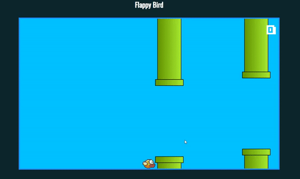

# Flappy Bird

 

Projeto desenvolvido durante o curso Web-Moderno utilizando JavaScript.

## Objetivos

Os objetivos deste projeto são:

Introduzir os conceitos sobre a manipulação da DOM.
Criação de elemetos HTML pelo JavaScript.

## Instalação

```bash
# Primeiramente clone o repositório 
https://github.com/JonasYo/flappy-bird.git

# Navegue até o diretório
cd flappy-bird

Click em INDEX.html, e rode em seu browser de preferência.
```

## Contribuições
Pull requests são bem-vindos.

## License
[MIT](https://choosealicense.com/licenses/mit/)
